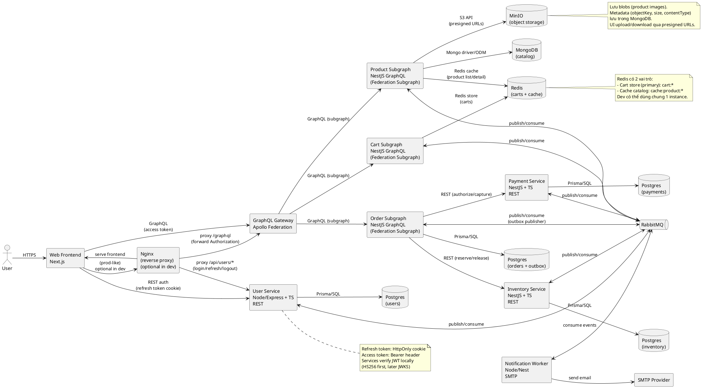

# Component Diagram — E-commerce Microservices (Nginx + Apollo Federation)

> GitHub không render PlantUML mặc định. Bạn có thể:
> - Dùng VS Code extension “PlantUML” để preview.
> - Export PNG/SVG nếu muốn embed vào README.

