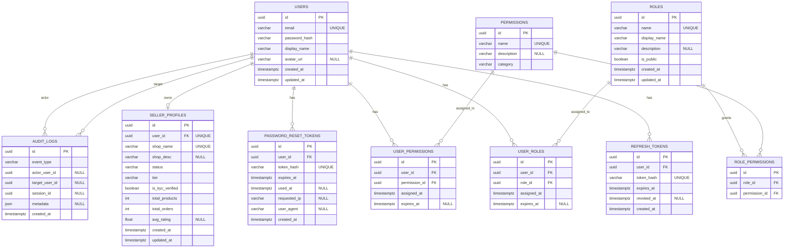

# user-service — Database diagram

Source of truth: `services/user-service/prisma/schema.prisma`

Notes
- Prisma maps tables with `@@map`: `User -> users`, `RefreshToken -> refresh_tokens`, `PasswordResetToken -> password_reset_tokens`.
- RBAC được biểu diễn qua các bảng `roles`, `user_roles`, `permissions`, `role_permissions`, `user_permissions` và `seller_profiles`.
- `RefreshToken.tokenHash` and `PasswordResetToken.tokenHash` are stored as hashes (recommended) instead of raw tokens.
- Relationships are `onDelete: Cascade` from `users`.
